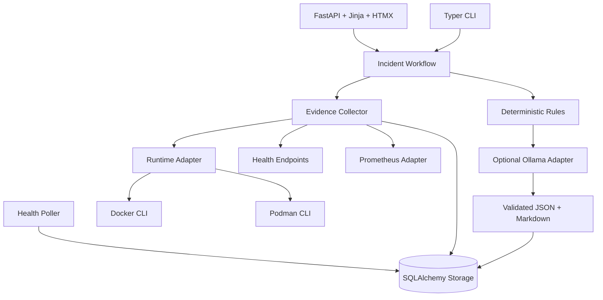

# IncidentPilot Architecture Overview

## Design goals

- Local-first and localhost-bound by default
- Read-only diagnosis before controlled self-healing
- Docker and Podman parity behind one interface
- Deterministic operational facts before LLM interpretation
- Structured outputs that are testable and renderable
- Graceful degradation when Ollama, logs, or Prometheus are unavailable
- SQLite first with PostgreSQL-compatible SQLAlchemy models

## Components

## Data flow

1. A manual CLI/UI action or health poll identifies a service.
2. The workflow creates an incident and marks it `analyzing`.
3. The evidence collector stores runtime status, bounded logs, health response,
   dependency state, metadata, metrics availability, and deployment events.
4. Rules assign baseline severity, cause, evidence references, and an
   execution-disabled recommendation.
5. Ollama may re-rank hypotheses and improve narrative text.
6. LLM output must validate against the schema and may reference only known
   evidence and deterministic action keys/policy flags.
7. Invalid, unavailable, or timed-out LLM output falls back to rules-only.
8. JSON and Markdown reports are persisted; the incident becomes `diagnosed`.
9. A human resolves the cause. Three successful health checks or a manual
   command marks the incident `resolved`; a resolved incident may be `closed`.

## Runtime adapters

Docker and Podman adapters use fixed subprocess argument lists with:

- no shell;
- strict container-name validation;
- timeouts;
- JSON parsing;
- structured errors;
- byte-limited logs.

The rest of the application calls `ContainerRuntimeAdapter` and contains no
runtime-specific command construction.

## Rules and LLM

Rules own operational truth:

- stopped target container;
- unhealthy target with failed dependency;
- application-level failure when dependencies are healthy;
- conservative severity;
- evidence gaps;
- safe recommendation action keys.

The LLM receives no raw terminal and cannot execute tools. It cannot add
unknown evidence, invent action keys, relax approval flags, enable execution,
or mark an action executed.

## Storage

Core entities:

- `Service`
- `HealthCheckResult`
- `DeploymentEvent`
- `Incident`
- `IncidentEvidence`
- `Hypothesis`
- `Recommendation`
- `IncidentReport`
- `AgentRun`

JSON columns store structured evidence and report payloads. SQLite is the
default; model types and constraints are compatible with PostgreSQL.

## Observability

Container state, health, and logs are primary evidence. Prometheus is
supplementary. Its absence becomes an evidence gap and does not stop analysis.
Grafana is for human review and is not in the decision path.

## Safety model

- Agent remediation: disabled
- Arbitrary shell: blocked
- Volume deletion: absent/blocked
- Recommendation execution fields: database- and schema-constrained false
- Dashboard settings: read-only
- Network bind: `127.0.0.1` by default
- Demo scenario runner: separate fixed allowlist for demo containers only
